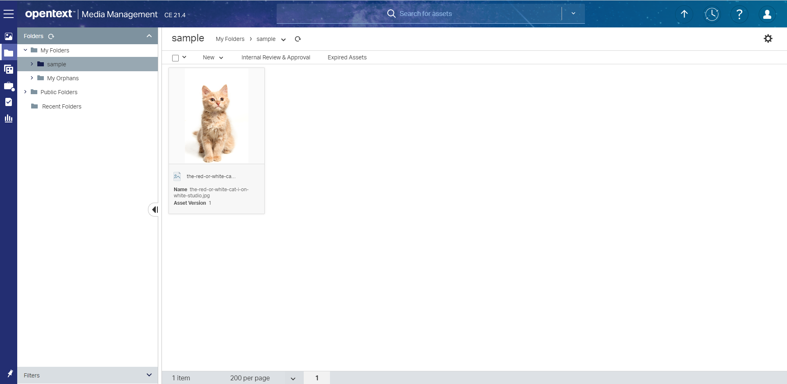

# OTMMAssetUploader

Command line tool to upload a file/s to an OpenText Media Management (OTMM) instance
using the [OTMM REST API](https://developer.opentext.com/apis/14ba85a7-4693-48d3-8c93-9214c663edd2/06c4a79f-3f4a-4a5a-aab9-9519740b27c7/1d6ec9c5-7620-456e-b52f-cfffb2734eb0).

> NOTE: This project is a technological demonstrator to show how to use  
> OTMM REST API. 
>
>It doesn't pretend to be a production-ready tool.
>
> On the other hand, OTMM provides a SDK that includes a API wrapper.

## What's OTMM?

[OpenText Media Management](https://www.opentext.com/products-and-solutions/products/customer-experience-management/digital-asset-management/opentext-media-management) 
is a leading, innovative and scalable DAM solution that optimizes rich media 
asset management, use and distribution across the digital ecosystem. From 
creation to consumption, Media Management offers a consolidated asset 
repository for marketing, branding, commerce, video and global distribution 
across contributors and production environments.

## How to run it?

The project includes a runnable jar file (see `versions` folder in this repository)

It accept the following parameters:

   - -c --config  <CONFIG_FILE> 
   - -a --asset   Asset file. If a directory is specified all the .png and .jgp will be uploaded.
   - -p --path    Path in OTMM to store the asset, e.g. "Public Folders\Stock\Stock Travel\Paris"

Execution example:

```
java -jar otmm-asset-uploader-22.03.15.jar --config otmm-api.properties --path "My Folders\sample" --asset the-red-or-white-cat-i-on-white-studio.jpg
```

Once you have executed this tool you will see your asset in OTMM



### otmm-api.properties

Configuration file that contains the information needed to access the OTMM REST API.
It contains the following parameters:

 - **url**: OpenText Media Management REST API URL
 - **version**: OpenText Media Management REST API version. Default value 6
 - **user**: OTMM user
 - **password**: OTMM password for the given user

```
url=http://mydomainexmple.com:11090
version=6
user=tsuper
password=<PASSORD_GOES_HERE>
```